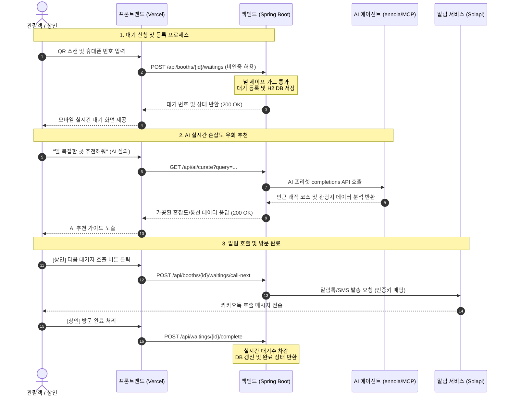

# 📱 fesgo - AI & 데이터 기반 스마트 축제 부스 웨이팅 서비스

> **"축제 부스 웨이팅을 AI와 모바일로 더 빠르게, fesgo"**  
> **개발팀**: data tour (데이터 기반 여정 디자인 팀)

---

## 💡 프로젝트 소개 & 주제 선정 이유
* **축제 혼잡 완화 및 안전 확보**: 포스트 코로나 이후 폭발적으로 늘어난 지역/대학 축제 현장의 긴 대기열은 이용 만족도를 저해하고 인파 밀집 사고 위험을 초래합니다. 물리적 줄서기를 디지털 대기표로 전환해 대기 혼잡을 원천 해소합니다.
* **소상공인 맞춤 저비용 대기 솔루션**: 대형 상업용 웨이팅 플랫폼은 높은 수수료와 전용 하드웨어 설치 장벽으로 인해 단기 가설 부스나 푸드트럭 소상공인들이 도입하기 어려웠습니다. 이에 앱 설치가 필요 없는 간편 QR 웹 대기 솔루션을 제공합니다.
* **AI 실시간 우회 동선 큐레이션**: 단순 순번 발급을 넘어, 관람객이 긴 대기 시간 동안 AI 챗봇(ennoia)에게 대안을 추천받아 덜 붐비는 부스나 쾌적한 인근 관광지를 탐방할 수 있도록 '지능형 축제 경험'을 지원합니다.

---

## ⚙️ 기술 스택 (Tech Stack)
* **Frontend**: Vanilla HTML/CSS, Javascript (Vercel 배포)
* **Backend**: Spring Boot 3.2.3, Java 17, Spring Security, Spring Data JPA
* **Database**: H2 Database (File Mode)
* **AI Integration**: ennoia AI Completions Engine, MCP (Model Context Protocol) Server
* **Messaging**: Solapi SMS/알림톡 발송 API

---

## 📌 주요 핵심 기능
1. **QR 스캔 기반 간편 대기 신청**: 앱 설치나 복잡한 가입 없이 현장 QR 스캔 후 휴대폰 번호만 입력해 3초 만에 대기번호 발급
2. **실시간 내 순서 폴링 (Polling)**: 모바일 브라우저 화면에서 내 순서 및 앞에 대기 중인 실제 팀 수를 실시간 확인
3. **카카오 알림톡/SMS 연동**: 상인이 호출 버튼을 클릭하면 솔라피를 통해 손님에게 입장 알림톡이 즉시 비동기 발송
4. **AI 실시간 중개 및 동선 추천**: ennoia AI 엔진이 실시간 관광지 혼잡도와 대기 현황을 계산해 쾌적한 최적 경로 가이드 응답

---

## 🔄 시스템 흐름도 (System Sequence Diagram)

---

## 🛠️ API 입출력 예시 (자연어 형태)

### 1. 맛집 부스 대기 신청
* **입력 (사용자 행동)**
  > 📱 '용문산 파전' 부스 QR 스캔 후, 휴대폰 번호(`010-9999-8888`) 입력하고 **[대기 신청]** 클릭
* **출력 (시스템 알림)**
  > 💬 **"대기 등록 완료! 고객님의 대기 번호는 27번입니다. 현재 고객님 앞에 대기 중인 팀은 4팀입니다. 입장 순서가 되면 알림톡으로 호출해 드리겠습니다."**

### 2. AI 동선 큐레이션 가이드
* **입력 (AI 질의)**
  > 🗣️ **"지금 용문면 주변에 있는데 5시간 동안 갈 만한 쾌적한 코스 짜줘."**
* **출력 (AI 에이전트 응답)**
  > 🤖 **"현재 가장 쾌적한 '양평 용문산 산나물 축제' 코스를 추천합니다! 인근 '용문사 은행나무'는 현재 혼잡도 35%로 한산하니 먼저 방문하시고, 축제장 이동 시 대기표를 발급하시면 동선 낭비가 없습니다."**
