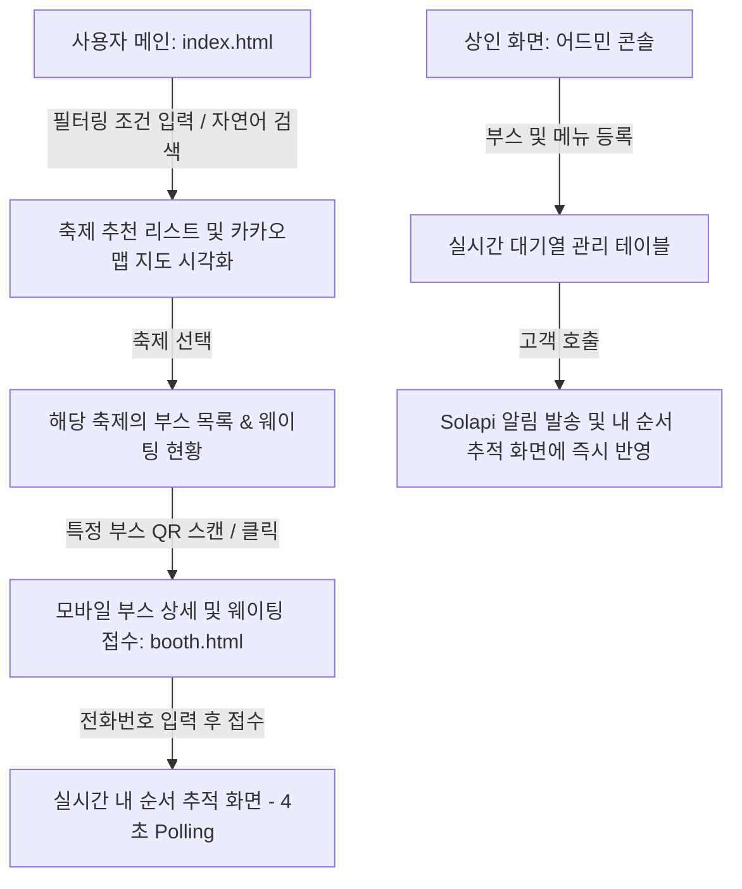

# 프론트엔드 UI/UX 상세 워크플로우 및 화면 설계 가이드

이 가이드는 프론트엔드 개발자가 사용자(손님) 및 상인 관점의 화면 레이아웃을 기획하고, 어떤 화면에서 어떤 백엔드 API를 연결해 데이터를 시각화해야 하는지 정리한 흐름도입니다.

---

## 1. 사용자(손님) 화면 및 워크플로우

### [화면 A] 메인 홈 화면 (`index.html`)
*   **UI 구성 요소**:
    *   **ennoia AI 자연어 검색창**: 사용자가 자유롭게 질문(예: *"가족들이랑 갈 건데 너무 멀지 않고 사람 붐비지 않는 조용한 축제랑 관광지 추천해줘"*)을 던질 수 있는 통합 입력창.
    *   **카드 필터링 영역**: [내 현위치 주소/좌표], [선호 반경(km)], [가용 시간(시간)] 등을 단계별로 조작할 수 있는 폼.
    *   **카카오맵 지도 영역**: 추천된 축제 장소와 그 주변 연계 관광지들을 지도 위에 마커(Pin)로 렌더링.
    *   **추천 카드 리스트**: 조건에 부합하는 축제 카드 목록.
*   **백엔드 API 연동 흐름**:
    1.  지도가 로드될 때 `/api/config/kakao-key`를 호출해 카카오 JavaScript SDK를 동적으로 초기화합니다.
    2.  자연어 검색 시 `/api/ai/curate?query=...` API를 연동합니다.
    3.  카드 필터 전송 시 `/api/festivals/recommend` API를 호출합니다.
    4.  결과값에 담긴 관광지(`TouristSpot`)의 **혼잡도(`congestionRate`)** 값에 따라 지도 마커의 색상을 변경합니다.
        *   `🟢 쾌적 (0 ~ 49%)` / `🟡 보통 (50 ~ 79%)` / `🔴 혼잡 (80 ~ 100%)`

---

### [화면 B] 축제 내 부스 목록 및 실시간 현황 화면
*   **UI 구성 요소**:
    *   **선택된 축제 정보**: 축제 이름, 기간, 대표 설명.
    *   **입점 부스 카드 리스트**: 각 부스의 위치 설명, 부스 대표 명칭, 메뉴 가짓수, **현재 실시간 대기 팀 수**.
*   **백엔드 API 연동 흐름**:
    1.  축제 카드를 클릭하면 `/api/festivals/{festivalId}/booths`를 호출하여 입점된 부스들과 실시간 대기자 카운트(`currentWaitingCount`)를 받아와 화면을 새로고침합니다.

---

### [화면 C] 모바일 부스 상세 및 대기 접수 화면 (`booth.html`)
*   **사용자 진입 경로**: 축제 현장 부스에 비치된 실제 **QR 코드를 모바일로 스캔**하여 진입 (`/booth.html?boothId=1`).
*   **UI 구성 요소**:
    *   **부스 대표 상세 정보**: 상점명, 위치 상세 설명, 소개글.
    *   **디지털 메뉴판**: 가격, 메뉴 설명, 그리고 **지역 특산물 메뉴 여부(IsSpecialty=true)**를 시각적 아이콘(예: 🌾 특산품)으로 하이라이팅 처리.
    *   **실시간 대기 신청 폼**: 휴대폰 번호 입력 및 개인정보 동의 토글, [실시간 대기 접수] 버튼.
*   **백엔드 API 연동 흐름**:
    1.  화면 진입 시 URL Query 파라미터에서 `boothId`를 읽어 `/api/booths/{boothId}`를 호출해 메뉴판을 렌더링합니다.
    2.  전화번호 입력 후 접수 버튼을 누르면 `/api/waitings` (POST) API를 호출해 접수를 완료하고 백엔드로부터 발급된 `waitingId`와 내 대기 번호를 획득합니다.
    3.  접수가 완료되면 Solapi를 통해 **"대기번호 X번으로 접수되었습니다. 현재 대기팀 수는 X팀입니다."** 알림 문자가 자동 전송됩니다.

---

### [화면 D] 모바일 실시간 순서 추적 화면 (`booth.html` 전환 뷰)
*   **UI 구성 요소**:
    *   **내 상태 알림 카드**: 큰 폰트로 내 대기번호(예: `15번`) 및 **내 앞에 대기 중인 팀 수(예: `3팀 남음`)**를 실시간으로 노출.
    *   **실시간 진행 바 (Progress Bar)**: 대기 접수완료 ➡️ 순서 임박(3순번 이내) ➡️ 호출됨 ➡️ 입장 완료의 4단계 상태 변환 상태를 시각화.
*   **백엔드 API 연동 흐름**:
    1.  프론트엔드에서는 `setInterval`을 활용해 **4초 주기**로 `/api/waitings/{waitingId}/status` API를 폴링(Polling) 호출합니다.
    2.  호출 결과에 담긴 내 앞 대기팀 수(`waitingTeamsAhead`)와 현재 상태(`status`)를 실시간으로 갱신합니다.
    3.  상태가 `CALLED`로 바뀌면 화면에 큰 벨소리/진동 연출과 함께 **"매장 앞으로 방문해 주세요!"** 팝업 경고창을 띄웁니다.
    4.  내 대기 순서가 3번 이내로 좁혀지면, 백엔드에서 비동기로 수신자(나)에게 **"대기 순서가 3순번 이내로 임박했습니다. 매장 근처에서 대기해 주세요."** 문자를 자동 발송하여 푸시 알림 효과를 냅니다.

---

## 2. 상인(점주) 화면 및 워크플로우

### [화면 E] 상점 등록 및 대기열 관리 콘솔
*   **UI 구성 요소**:
    *   **부스/메뉴 등록 폼**: 부스명, 위치 설명, 메뉴 이름, 가격, 특산품 태그 설정.
    *   **실시간 대기 관리 테이블**:
        *   대기자 목록: 대기번호, 휴대폰 번호, 신청일시, 현재 상태(`WAITING`, `CALLED`, `COMPLETED`, `CANCELLED`).
        *   제어 버튼 그룹: **[🔊 고객호출]** (호출 문자가 Solapi로 자동 전송됨), **[✅ 입장완료]**, **[❌ 노쇼취소]**.
*   **백엔드 API 연동 흐름**:
    1.  상점 개설 및 메뉴판 세팅 시 `POST /api/booths` API를 호출합니다.
    2.  고객을 부를 때 **[🔊 고객호출]** 버튼을 누르면 `/api/waitings/{waitingId}/call` (POST) API를 전송합니다.
    3.  입장 처리 시 `/api/waitings/{waitingId}/complete`를 호출하고, 노쇼나 취소 시 `/api/waitings/{waitingId}/cancel`을 호출합니다.
