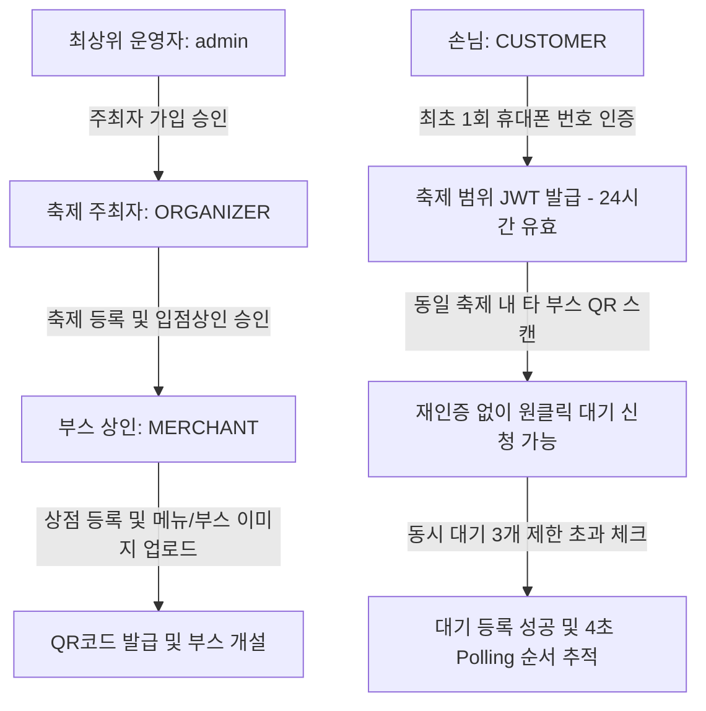

# 프론트엔드 UI/UX 상세 워크플로우 및 화면 설계 가이드

이 가이드는 프론트엔드 개발자가 최상위 운영자, 축제 주최측, 상인, 손님(방문객) 관점의 화면 레이아웃을 기획하고, 각 화면별 백엔드 API 및 JWT 인증 상태를 연동하는 흐름도입니다.

---

## 1. 역할별 가입 및 다단계 승인 워크플로우

### [흐름 1] 최상위 운영자(System Admin) 및 주최측(Organizer)
1.  **최초 어드민 로그인**:
    *   최상위 어드민 계정(기본 ID: `admin` / PW: `admin1234`)으로 로그인하여 시스템에 접근합니다.
2.  **주최자 회원가입 및 승인**:
    *   축제 기획자는 회원가입 시 `ROLE_ORGANIZER` 역할로 등록을 신청하며, 기본적으로 **미승인(Pending)** 상태가 됩니다.
    *   최상위 어드민은 어드민 콘솔(`GET /api/admin/organizers/pending`)에서 대기 중인 주최자 목록을 조회하고, **[승인]** 처리(`POST /api/admin/organizers/{id}/approve`)를 진행하여 활성화합니다.
3.  **축제 등록 개최**:
    *   승인이 완료된 주최자는 로그인 토큰(JWT)을 획득하고, 본인 계정의 권한을 사용하여 신규 축제를 신설합니다 (`POST /api/organizer/festivals`).

### [흐름 2] 주최측(Organizer) 및 입점 상인(Merchant)
1.  **상인 회원가입 및 입점 승인**:
    *   상인은 회원가입 시 `ROLE_MERCHANT` 역할로 가입하며, 주최측의 승인을 대기합니다.
    *   주최자는 자신의 주최자 콘솔(`GET /api/organizer/merchants/pending`)에서 내 축제에 입점을 신청한 상인 목록을 조회하고, **[승인]** 처리(`POST /api/organizer/merchants/{id}/approve`)합니다.
2.  **부스 및 이미지 등록**:
    *   승인된 상인은 로그인하여 JWT 토큰을 획득하고, 본인 상점 부스 정보 및 메뉴 리스트를 등록합니다 (`POST /api/booths`).
    *   **이미지 업로드 연동**: 부스 사진이나 개별 메뉴 사진을 등록할 때, 먼저 파일 업로드 API(`POST /api/files/upload`)를 찔러 반환된 로컬 이미지 상대 경로(예: `/uploads/uuid.png`)를 등록 Body의 `imageUrl`에 매핑합니다.

---

## 2. 손님(방문객) 화면 및 무가입 상태 복원 워크플로우

### [화면 A] 메인 홈 화면 (`index.html`)
*   **UI 구성 요소**:
### [화면 D] 모바일 실시간 순서 추적 화면 (`booth.html` 전환 뷰)
*   **UI 구성 요소**:
    *   **내 상태 알림 카드**: 큰 폰트로 내 대기번호(예: `15번`) 및 **내 앞에 대기 중인 팀 수(예: `3팀 남음`)**를 실시간으로 노출.
    *   **실시간 진행 바 (Progress Bar)**: 대기 접수완료 ➡️ 순서 임박(3순번 이내) ➡️ 호출됨 ➡️ 입장 완료의 4단계 상태 변환 상태를 시각화.
*   **백엔드 API 연동 흐름**:
    1.  프론트엔드에서는 `setInterval`을 활용해 **4초 주기**로 `/api/waitings/{waitingId}/status` API를 폴링(Polling) 호출합니다.
    2.  호출 결과에 담긴 내 앞 대기팀 수(`waitingTeamsAhead`)와 현재 상태(`status`)를 실시간으로 갱신합니다.
    3.  상태가 `CALLED`로 바뀌면 화면에 큰 벨소리/진동 연출과 함께 **"매장 앞으로 방문해 주세요!"** 팝업 경고창을 띄웁니다.
    4.  내 대기 순서가 3번 이내로 좁혀지면, 백엔드에서 비동기로 수신자(나)에게 **"대기 순서가 3순번 이내로 임박했습니다. 매장 근처에서 대기해 주세요."** 문자를 자동 발송하여 푸시 알림 효과를 냅니다.

---

## 2. 상인(점주) 화면 및 워크플로우

### [화면 E] 상점 등록 및 대기열 관리 콘솔
*   **UI 구성 요소**:
    *   **부스/메뉴 등록 폼**: 부스명, 위치 설명, 메뉴 이름, 가격, 특산품 태그 설정.
    *   **실시간 대기 관리 테이블**:
        *   대기자 목록: 대기번호, 휴대폰 번호, 신청일시, 현재 상태(`WAITING`, `CALLED`, `COMPLETED`, `CANCELLED`).
        *   제어 버튼 그룹: **[🔊 고객호출]** (호출 문자가 Solapi로 자동 전송됨), **[✅ 입장완료]**, **[❌ 노쇼취소]**.
*   **백엔드 API 연동 흐름**:
    1.  상점 개설 및 메뉴판 세팅 시 `POST /api/booths` API를 호출합니다.
    2.  고객을 부를 때 **[🔊 고객호출]** 버튼을 누르면 `/api/waitings/{waitingId}/call` (POST) API를 전송합니다.
    3.  입장 처리 시 `/api/waitings/{waitingId}/complete`를 호출하고, 노쇼나 취소 시 `/api/waitings/{waitingId}/cancel`을 호출합니다.
